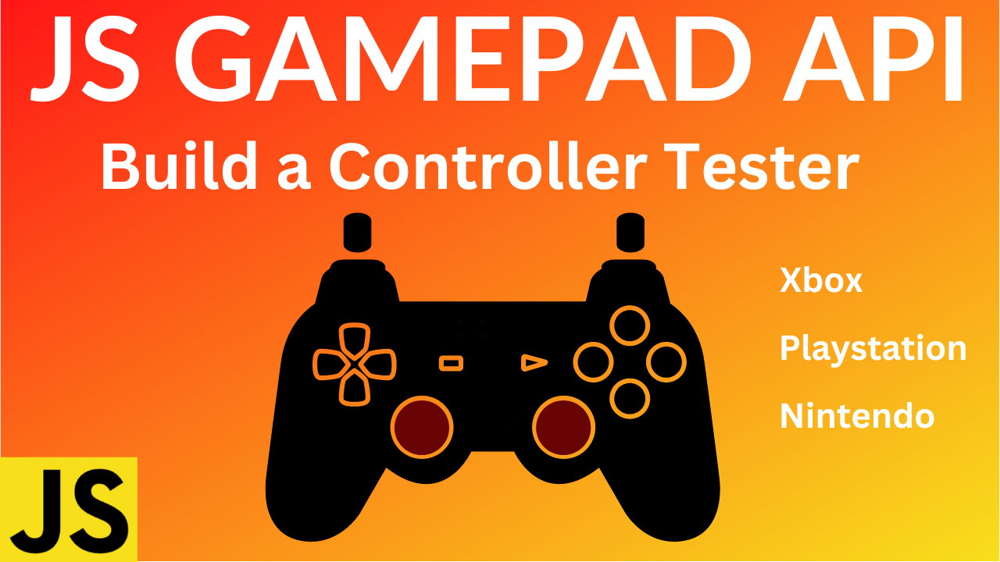

# Learn JavaScript Gamepad API and Build a Gamepad Tester

### Try it here: https://codingwith-adam.github.io/gamepad-tester/

### YouTube Tutorial: https://youtube.com/c/codingwithadam

## Description

In this exciting tutorial we are going to learn how to use the JavaScript Gamepad API. With this API we are going to build our very own gamepad tester. A gamepad tester allows you to diagnose and figure out if anything is wrong with your controller.

### Gamepad API

https://developer.mozilla.org/en-US/docs/Web/API/Gamepad_API
